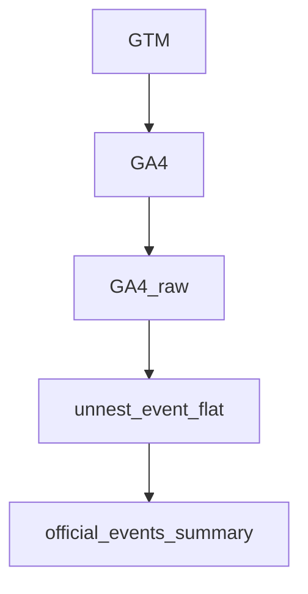

# session-click-anchor-attribution-model
interval-based attribution model using session anchors and window function inBigQuery.

README

## 概要
このプロジェクトはGA4において、日跨ぎセッションを考慮した上で、
複数あるアンカーページのうち、通過したページの種類ごとにセッション属性を確定して、
BI用に、属性ごとにイベント・セッションを集計したテーブルを作成する実装例です。



インターバルの確定にはJOINではなくWINDOW関数を用い、粒度崩壊並び多対多爆発を防ぐ設計としています。

## 詳細

特定のページ（/official-events/を含む全てのページ）、そのセッションの入り口source、デバイスを基準として、
このページを通ったのちの、以下のページセッションとボタンクリックを全てofficial-eventsページに載せる。


## 課題間
GA4のイベントデータはevent粒度のため、
official-eventsページを基点としたセッション分析が困難。

## Approach
Window関数を用いて
セッション内で最後に通過したofficial-eventsページを
アンカーページとして付与する。

## テーブルイメージとテーブルスキーマ
### テーブルイメージ
### Sample Output

| event_date | entrance_source | event_page_location | device_category | All_official_events_session | All_questionnaire_entrance_session | Click_All_event_participattion |
|------------|----------------|---------------------|-----------------|-----------------------------|-------------------------------------|--------------------------------|
| 2026-02-17 | Organic | /official-events/12 | mobile | 2 | 1 | 1 |
| 2026-02-17 | Organic | /official-events/12 | desktop | 0 | 0 | 0 |
| 2026-02-17 | X | /official-events/12 | mobile | 1 | 0 | 1 |
| 2026-02-17 | instagram | /official-events/12 | mobile | 1 | 1 | 0 |

### テーブルスキーマ
  
- event_date,DATE
- entrance_source,STRING
- event_page_location,STRING
- device_category,STRING

以下全てINT64
    -- ★ 全部の属性総計
- All_official_events_session,
- All_questionnaire_entrance_session,
- All_questionnaire_complete_session,
- All_LP_after_questionnaire_complete_session,
- Click_All_event_participattion,
- Click_All_questionnaire_complete_event_participattion,
- Click_All_googleform_event_participattion,

  -- ★ ログインユーザー
- login_official_events_session,
- login_questionnaire_entrance_session,
- login_questionnaire_complete_session,
- login_LP_after_questionnaire_complete_session,
- Click_login_event_participattion,
- Click_login_questionnaire_complete_event_participattion,
- Click_login_googleform_event_participattion,

  -- ★ 未ログインユーザー全て
- UnloginAll_official_events_session,
- UnloginAll_questionnaire_entrance_session,
- UnloginAll_questionnaire_complete_session,
- UnloginAll_LP_after_questionnaire_complete_session,
- Click_UnloginAll_event_participattion,
- Click_UnloginAll_questionnaire_complete_event_participattion,
- Click_UnloginAll_googleform_event_participattion



## 計測環境
### サイトのファネル
/official-events/　ページ
↓

"Go"ボタンクリック

↓

''と’’を含むページに遷移。
ボタンを押すことでユーザーごとに発行される。　（このページ以外に、これらをURLにもつページはない）
↓
"Submit"ボタンクリック

↓
''と’’を含むページに遷移。
ボタンを押すことでユーザーごとに発行される。　（このページ以外に、これらをURLにもつページはない）
↓
'back_to_home'ボタンクリック
↓
''と’’を含むページに遷移　（このページ以外に、これらをURLにもつページはない）
↓
google form

### GTMのイベント設定
該当のボタンクリックは以下イベントで取れている。
* OfficialEventsClick（"GO"ボタン、"Submit"ボタン、'back_to_home'ボタン）
    * classが付与されているので、Click_class名でクリック箇所を判別できるよう、
event_paramsにClick_Classesを取得。
* AfterQuestionnaireGoogleFormClick
    * google formはclass付与がないため、CSSセレクタで選択。
### GA4→BQのパイプライン
* GA4 analyticsのUIでBQと連携。（Google側に依存。）


## 要件

* ログインユーザー
    * これらを通らずに以下。
        * offical-events/  より後に、users/add を通らなかったもの
（offial-events/ より前に未ログインだった→ログインしたユーザーもこちらに含まれる。）
* 未ログインユーザー
    * official-events/  より後に users/add を通ったもの全て
* 未登録ユーザ・同時登録ユーザー
    * 未ログインユーザーのうちnew_users/which を通ったものとする
    * 未ログインユーザーのうち/new_users/adult_basic/agreement を通ったものとする
　
## 定義
* BIでグラフが欠損しない。（日付・デバイス・入り口source単位で）
* official-eventsページにカウントしたセッション・クリック数が帰属するようにする。
* セッションの日付は発生時（開始日ではない）
* アンカーページ通過時のフラグのgrainはセッション単位(CONCAT(user_pseudo_id,'-',ga_session_id))

## テーブル一覧
- GAraw：GA4の生データ、NESTあり。
- unnest_event_flat：GA4の生データに対して、NESTされているものを縦持ちにしたもの
- official_events_summary：要件に合わせて、`official-events`ページに対してアトリビューション集計をしたもの。
こちらの作成・運用管理が今回のプロジェクトのゴール

## DAG（データフロー）

                
## SQL
- sql/01_make_flat_table.sql  → unnest_event_flat作成時
- sql/02_session_click_anchor_attribution_model.sql　→　official_events_summary作成時
※それぞれSQLフォルダにコードあり。

### unnest_event_flat内の粒度
rawをunnestして、event_paramsを縦持ちにしたもの。
※SQL/01_make_flat_tabel.sqlにコード例あり。

### agg/martのSQL内の粒度（CTE）
※SQL/02_session_click_anchor_attribution_model.sqlにコード例あり。

* normalized 

→flatから必要なevent_paramsを取り出したもの

* date_base

→日付欠損防止のための日付ベースCTE

* entrance_source_base

→入り口のsource欠損のためのベースCTE

* device_category_base

→デバイス欠損防止のためのデバイスベースCTE

* base

→イベント粒度で、baseを正規化(utmを抜き出す)、直前の/official-events/をwindowで持つ。
（セッションカウントやクリックカウントを正確にofficial-events/[0-9+]ページに帰属させるため
直近のofficial-events/[0-9+]ページをwindow関数で保持し、ページの帰属元と帰属範囲を確定。）

* session_flag

→セッション粒度で、フラグ、デバイスの確定を行う。

* session_count

→日付、/official-events/ページ、デバイス、入り口sourceごと、ユーザー属性ごとにセッションカウント

* click_count

→日付、/official-events/ページ、デバイス、入り口sourceごと、ユーザー属性ごとにクリックカウント

* 最終SELCT

→日付、/official-events/ページ、デバイス、入り口sourceごとに集計。


### バックフィル
* CURRENT_DATE INTERVAL 7 DAY ~ CURRENT_DATE INTERVAL 2 DAY の期間をDELETE&INSERT
* 毎日JST09:00に実行

### データ品質管理
* CTE”base  ”のもとになるflatの品質を、rawのイベントパラメータ数をSQLで監視することで担保。

→rawのパラメータが綺麗にflatに落ちているかを監視。数値の不一致が発生した場合はflatを作成しているバックフィルSQLの見直しを実施する。





