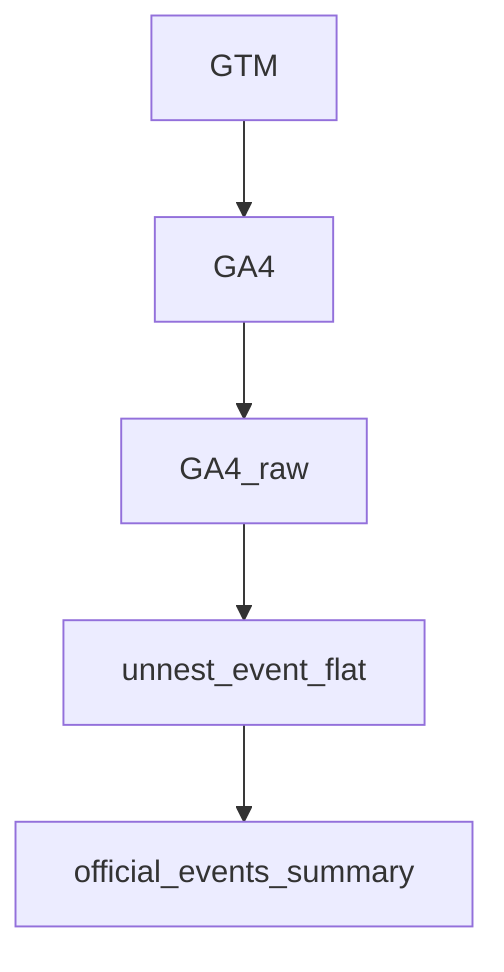

# session-click-anchor-attribution-model
interval-based attribution model using session anchors and window function in BigQuery.

README

## このデポジトリ内のファイル構造（目次）
```
dbt：dbt設計関係
  ├─macros：macroフォルダ 
  ├─models：SQLモデルフォルダ
  └─ tests：テスト関係のフォルダ
sample_output：作成したテーブルのサンプル
sql：SQLファイルが格納してあるフォルダ   
```
※dbtフォルダの詳細は、[README_dbtCLI.md](https://github.com/xia9796-cd/session-click-anchor-attribution-model/blob/main/dbt/README_dbt_CLI.md)に記載。

## 概要
このプロジェクトはGA4において、日跨ぎセッションを考慮した上で、

アンカーページに対して、通過したページの種類ごとにセッション属性を確定して、
BI用に、属性ごとにイベント・セッションを集計したテーブルを作成する実装例です。



インターバルの確定にはJOINではなくWINDOW関数を用い、粒度崩壊並び多対多爆発を防ぐ設計としています。

## 詳細

特定のページ（/official-events/を含む全てのページ）、そのセッションの入り口source、デバイスを基準として、

 このページを通ったのちの、
 - それ以降の指定ページセッション
 - ボタンクリック
 - CTR等の算出済みメトリクス
以上全てをofficial-eventsページに載せる。



## 課題感
GA4のイベントデータはevent粒度のため、
official-eventsページを基点としたセッション分析が困難。

また、セッションが日またぎになる場合、通常のセッション集計では正しい`anchor_page_location`のattributionができない。

さらに、`official-events`ページからイベント参加までの動線をデバイス・流入別に分析する必要がある。

## アプローチ
1. GA４　rawをフラット化
2. session_anchorを計算
3. session/clickを分離
4. martテーブルを作成。

以上を、Window関数を用いて
セッション内で最後に通過した`official-events`ページを
`anchor_page_location`として付与する。


## 計測環境
### サイトのファネル
```
/official-events/　ページ
↓

"Go"ボタンクリック

↓

''と’’を含むページ（アンケート回答ページ）に遷移。
ボタンを押すことでユーザーごとに発行される。　（このページ以外に、これらをURLにもつページはない）
↓
"Submit"ボタンクリック

↓
''と’’を含むページ（アンケート回答完了ページ）に遷移。
ボタンを押すことでユーザーごとに発行される。　（このページ以外に、これらをURLにもつページはない）
↓
'back_to_home'ボタンクリック
↓
''と’’を含むページに遷移　（このページ以外に、これらをURLにもつページはない）
↓
google form

```
### GTMのイベント設定
該当のボタンクリックは以下イベントで取れている。
* OfficialEventsClick（イベント参加時の"GO"ボタン、回答後のLP遷移する'back_to_home'ボタン）
    * classが付与されているので、Click_class名でクリック箇所を判別できるよう、
event_paramsにClick_Classesを取得。
* AfterQuestionnaireGoogleFormClick
    * google formはclass付与がないため、CSSセレクタで選択。
### GA4→BQのパイプライン
* GA4 analyticsのUIでBQと連携。（Google側に依存。）


## テーブルイメージとテーブルスキーマ
### SQLで集計するデータ
日付、アンカーページ、デバイス、流入元ごとに、ユーザー属性ごとに
- アンカーページ（`offiial-events`含むページ）セッション数
- アンケート回答ページセッション数
- アンケート回答完了ページセッション数
- アンケート完了後のボタンクリックで遷移するLPページセッション数
- アンケート参加ボタンクリック数
- アンケート完了後、LPページに遷移するボタンクリック数
- アンケート参加率（アンケート回答ページセッション数/アンカーページセッション数）
- アンケート回答完了率（アンケート回答完了ページセッション数/アンケート回答完了ページセッション数）

以上を算出する。
  

### テーブルイメージ
### Sample Output

| event_date | entrance_source | event_page_location | device_category | All_official_events_session | All_questionnaire_entrance_session | Click_All_event_participattion |
|------------|----------------|---------------------|-----------------|-----------------------------|-------------------------------------|--------------------------------|
| 2026-02-17 | Organic | /official-events/12 | mobile | 2 | 1 | 1 |
| 2026-02-17 | Organic | /official-events/12 | desktop | 0 | 0 | 0 |
| 2026-02-17 | X | /official-events/12 | mobile | 1 | 0 | 1 |
| 2026-02-17 | instagram | /official-events/12 | mobile | 1 | 1 | 0 |


### テーブルスキーマ
  
- event_date,DATE
- entrance_source,STRING
- event_page_location,STRING
- device_category,STRING


  
    -- ★ 全部の属性総計(全ユーザー)
- All_official_events_session,INT64
- All_questionnaire_entrance_session,INT64
- All_questionnaire_complete_session,INT64
- All_LP_after_questionnaire_complete_session,INT64
- Click_All_event_participattion,INT64
- Click_All_questionnaire_complete_event_participattion,INT64
- Click_All_googleform_event_participattion,INT64


  -- ★ ログインユーザー全て（全ユーザーのうちログインをすでにしているユーザー）
- login_official_events_session,INT64
- login_questionnaire_entrance_session,INT64
- login_questionnaire_complete_session,INT64
- login_LP_after_questionnaire_complete_session,INT64
- Click_login_event_participattion,INT64
- Click_login_questionnaire_complete_event_participattion,INT64
- Click_login_googleform_event_participattion,INT64

  -- ★ 未ログインユーザー全て（全ユーザーのうちofficial_eventsページ到達後にログインがあったユーザー）
- UnloginAll_official_events_session,INT64
- UnloginAll_questionnaire_entrance_session,INT64
- UnloginAll_questionnaire_complete_session,INT64
- UnloginAll_LP_after_questionnaire_complete_session,INT64
- Click_UnloginAll_event_participattion,INT64
- Click_UnloginAll_questionnaire_complete_event_participattion,INT64
- Click_UnloginAll_googleform_event_participattion,INT64


  -- ★ イベント参加率
- All_events_participate_rate,FLOAT64
- login_events_participate_rate,FLOAT64
- UnloginAll_events_participate_rate,FLOAT64
- UnloginNew_events_participate_rate,FLOAT64

  -- ★ イベント完了率
- All_questionnaire_complete_rate,FLOAT64
- login_questionnaire_complete_rate,FLOAT64
- UnloginAll_questionnaire_complete_rate,FLOAT64
- UnloginNew_questionnaire_complete_rate,FLOAT64


## 要件

* ログインユーザー
    * 以下を通らずに`official-events`以降に進んだユーザー。
        * offical-events/  より後に、users/add を通らなかったもの
（offial-events/ より前に未ログインだった→ログインしたユーザーもこちらに含まれる。）
* 未ログインユーザー
    * official-events/  より後に users/add を通ったユーザー全て。
* 未登録ユーザ・同時登録ユーザー
    * 未ログインユーザーのうちnew_users/which を通ったものとする
    * 未ログインユーザーのうち/new_users/adult_basic/agreement を通ったものとする
　
## 定義
* BIでグラフが欠損しない。（日付・デバイス・入り口source単位で）
* official-eventsページにカウントしたセッション・クリック数が帰属するようにする。
* セッションの日付は発生時（開始日ではない）
* アンカーページ通過時のフラグのgrainはセッション単位(CONCAT(user_pseudo_id,'-',ga_session_id))

## テーブル一覧
- `project199709.analytics_00000008.events_{{YYYYMMDD}}`
：GA4の生データ、NESTあり。
- `project199709.analytics_00000008.unnest_event_flat`
：GA4の生データに対して、NESTされているものを縦持ちにしたもの
- `project199709.agg_tabels_for_BI.official_events_summary`
：要件に合わせて、`official-events`ページに対してアトリビューション集計をしたもの。
こちらの作成・運用管理が今回のプロジェクトのゴール

## DAG（データフロー）

                
## SQL
- `sql/01_make_flat_table.sql`  → `unnest_event_flat`作成・更新時
- `sql/02_session_click_anchor_attribution_model.sql`　→　`official_events_summary`テーブル作成・更新時
※それぞれsqlフォルダにコードあり。

### unnest_event_flat内の粒度
rawをunnestして、event_paramsを縦持ちにしたもの。
※`sql/01_make_flat_tabel.sql`にコード例あり。

### agg/martのSQL内の粒度（CTE）
※`sql/02_session_click_anchor_attribution_model.sql`にコード例あり。

* normalized 

→flatから必要なevent_paramsを取り出したもの

* date_base

→日付欠損防止のための日付ベースCTE

* entrance_source_base

→入り口のsource欠損のためのベースCTE

* device_category_base

→デバイス欠損防止のためのデバイスベースCTE

* base

→イベント粒度で、baseを正規化(utmを抜き出す)、直前の/official-events/をwindowで持つ。
（セッションカウントやクリックカウントを正確にofficial-events/[0-9+]ページに帰属させるため
直近のofficial-events/[0-9+]ページをwindow関数で保持し、ページの帰属元と帰属範囲を確定。）

* session_flag

→セッション粒度で、フラグ、デバイスの確定を行う。

* session_count

→日付、/official-events/ページ、デバイス、入り口sourceごと、ユーザー属性ごとにセッションカウント

* click_count

→日付、/official-events/ページ、デバイス、入り口sourceごと、ユーザー属性ごとにクリックカウント

* 最終SELCT

→日付、/official-events/ページ、デバイス、入り口sourceごとにJOINし、`session_count`と`click_count`でカウントした指標に加え、
  イベント参加率とアンケート完了率を算出。



### バックフィル（incremental design）
* CURRENT_DATE INTERVAL 7 DAY ~ CURRENT_DATE INTERVAL 2 DAY の期間をDELETE&INSERT
* 毎日JST09:00に実行
→GA4のデータが落ちるまでの遅延を考慮して、期間の開始日をINTERVAL7日前からにしている。
→またGA4ではリアルタイムでデータテーブルが作られるわけではないので、確実にデータが存在する2日前までを期間の終了日にする

### データ品質管理
#### データ母数チェック
* CTE”base  ”のもとになるflatの品質を、rawのイベントパラメータ数をSQLで監視することで担保。

→rawのパラメータが綺麗にflatに落ちているかを監視。数値の不一致が発生した場合はflatを作成しているバックフィルSQLの見直しを実施する。

```
DECLARE start_date DATE DEFAULT DATE_SUB(CURRENT_DATE("Asia/Tokyo"), INTERVAL 30 DAY);
DECLARE end_date   DATE DEFAULT DATE_SUB(CURRENT_DATE("Asia/Tokyo"), INTERVAL 2 DAY);
DECLARE sql STRING;

SET sql = (
  SELECT STRING_AGG(
    FORMAT("""
      SELECT
        DATE '%s' AS event_date,
        COUNT(*) AS raw_event_cnt,
        SUM(ARRAY_LENGTH(event_params)) AS raw_param_cnt
      FROM `project199709.analytics_00000008.events_%s`
    """,
    FORMAT_DATE('%Y-%m-%d', d),
    FORMAT_DATE('%Y%m%d', d)
    ),
    "\nUNION ALL\n"
  )
  FROM UNNEST(GENERATE_DATE_ARRAY(start_date, end_date)) d
);

EXECUTE IMMEDIATE FORMAT("""
WITH daily AS (
  SELECT
    event_date,
    EXTRACT(DAYOFWEEK FROM event_date) AS weekday_num, -- 1=Sun, 7=Sat
    COUNT(*) AS row_count
  FROM `project199709.analytics_00000008.unnest_event_flat`
  WHERE event_date >= DATE_SUB(CURRENT_DATE("Asia/Tokyo"), INTERVAL 30 DAY)
  GROUP BY event_date, weekday_num
),

daily_with_prev AS (
  SELECT
    event_date,
    weekday_num,
    row_count,
    LAG(row_count) OVER (ORDER BY event_date) AS prev_day_row_count
  FROM daily
),

raw_daily AS (
%s
)

SELECT
  d.event_date,
  d.weekday_num,
  d.row_count AS flat_row_count,
  r.raw_param_cnt,

  r.raw_param_cnt - d.row_count AS diff_from_raw_param_cnt


FROM daily_with_prev d
LEFT JOIN raw_daily r
  ON d.event_date = r.event_date
ORDER BY d.event_date DESC
""", sql);

```
こちらで、`diff_from_raw_param_cnt`の結果が０になる。
 `r.raw_param_cnt - d.row_count`はrawのevent_params数とflatの行数を比較している。
 flatはrawのevent_paramsのみ展開しているから、上記の二つが同じ数値になるので、diffして結果が０になればテストOK。
 

#### NULLチェック
event_page_locationは`official-events`ページの訪問がない場合
NULLになることがある。

その場合、メトリクスは全て０であることを確認する。
```
<<テスト用SQL>>
SELECT COUNT(*) as row
 FROM `project199709.agg_tabels_for_BI.official_events_summary` 
WHERE event_page_location IS NULL
AND (All_official_events_session >0
OR Click_All_event_participattion>0)
```
以上で、結果が

```
row
0
```
#### grainチェック
```
SELECT 
event_date,
entrance_source,
device_category,
event_page_location,
COUNT(*) as row
 FROM `project199709.agg_tabels_for_BI.official_events_summary` 
group by 1,2,3,4
HAVING count(*) >1
```
以上で、結果なし。grain正常。

#### セッション合計チェック
All_official_events_sessionが各セグメントの合計と一致すること。
```
SELECT 
SUM(All_official_events_session) as All_sessions,
SUM(login_official_events_session)
+SUM(UnloginAll_official_events_session) as login_and_unlogin_sessions
 FROM `project-0b98897e-3787-4157-aca.agg_table.official_events_summary_direct` 
```
以上の結果で、 All_sessionsと、login_and_unlogin_sessionsの結果が同じ数字になればOK。
同じ観点で、他のsessionやclick全てをテスト。

#### rateのエラーチェック
rate系の指標が正しく出ているかを以下で検証。

```
SELECT * FROM `project-0b98897e-3787-4157-aca.agg_table.official_events_summary_direct` 
WHERE All_events_participate_rate >1
OR All_questionnaire_complete_rate>1
OR login_events_participate_rate >1
OR login_questionnaire_complete_rate >1
OR UnloginAll_events_participate_rate >1
OR UnloginAll_questionnaire_complete_rate >1
OR UnloginNew_events_participate_rate >1
OR UnloginNew_questionnaire_complete_rate>1
```
こちらで、表示されるデータなし。OK。






